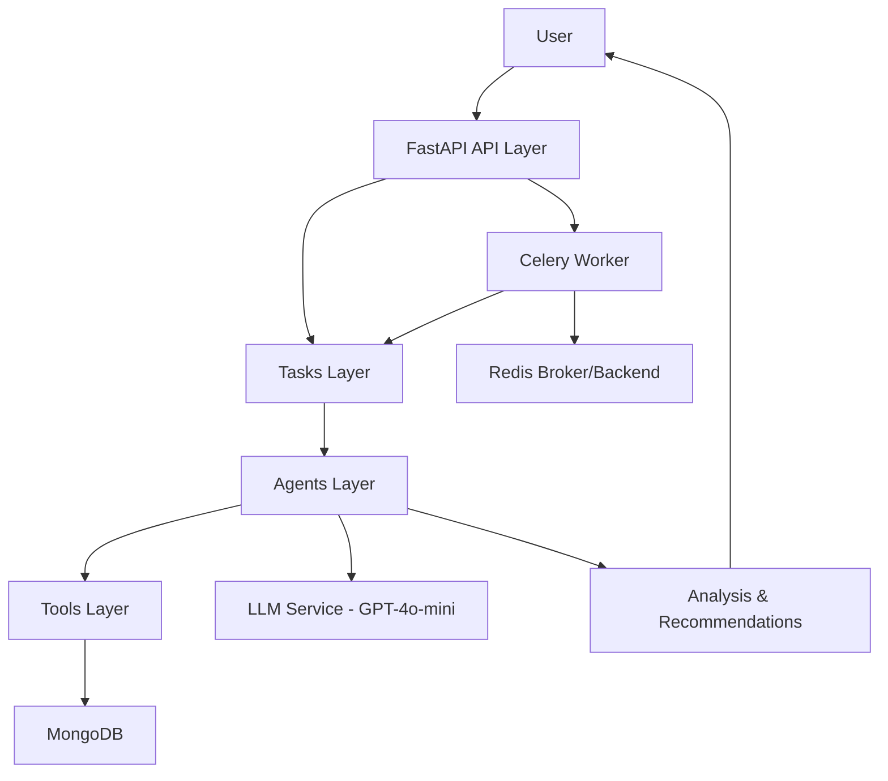

---

# Financial Document Analyzer

## Debugging Report – Fixed Bugs

This project was initially buggy and incomplete. The following issues were fixed to make it production-ready:

### agents.py

* Fixed LLM initialization: Added proper LLM import and configuration
* Improved agent roles/goals: Changed from sarcastic/unprofessional to proper financial analysis roles
* Fixed tool assignments: Agents now have appropriate tools assigned
* Added proper backstories: Professional, credible backgrounds for each agent
* Fixed parameter names: Changed `tool=` to `tools=` (plural)

### task.py

* Rewrote task descriptions: From humorous/sarcastic to professional financial analysis tasks
* Fixed expected outputs: From made-up content to legitimate financial analysis expectations
* Proper tool assignments: Each task now uses appropriate tools
* Correct agent assignments: Tasks assigned to the right specialized agents

### tools.py

* Complete overhaul with real implementations
* Added regex-based financial ratio extraction
* Fixed tool signatures with dict input handling
* Added error handling for file operations
* Created proper `Tool` objects with descriptions

### main.py

* Added Celery integration for background task processing
* Added MongoDB storage for persistence
* Improved error handling
* Added `/result/{task_id}` endpoint for task progress tracking
* UUID-based file handling and cleanup

### tasks1.py

* Created Celery task for async crew execution
* Implemented minimal working crew setup

### savedb.py

* Added MongoDB integration for result storage
* Added error handling for database operations

### celery\_app.py

* Configured Celery with Redis broker/backend
* Included tasks1 module

### requirements.txt

* Updated dependencies (OpenTelemetry bumped for compatibility)
* Maintained CrewAI version (0.130.0)

### README.md

* Rewritten with complete project documentation, setup, and usage details
* Added API endpoint documentation
* Added architecture diagram

### .gitignore

* Standard Python and environment exclusions added

---

## Overview

The **Financial Document Analyzer** is an AI-powered system for analyzing financial documents such as annual reports, quarterly updates, and investor presentations.

It combines:

* **FastAPI** for serving APIs
* **CrewAI agents** for document parsing, validation, and analysis
* **Celery with Redis** for background processing
* **MongoDB** for optional result storage

### Features

* Upload and process PDF financial documents
* Extract key financial metrics and trends
* Generate investment recommendations
* Perform risk assessments
* Validate and verify document content
* Scalable background processing with Celery

---

## Quick Start

Clone the repository and install dependencies:

```bash
git clone https://github.com/<your-username>/financial-document-analyzer.git
cd financial-document-analyzer
pip install -r requirements.txt
```

Run the FastAPI server:

```bash
uvicorn main:app --reload
```

---

## Requirements

* Python 3.10+
* Redis (for Celery broker/backend)
* MongoDB (optional for result storage)

Install dependencies:

```bash
pip install -r requirements.txt
```

---

## Environment Setup

Create a `.env` file in the project root:

```env
OPENAI_API_KEY=your_api_key_here
MONGO_URI=mongodb://localhost:27017
REDIS_URL=redis://localhost:6379/0
```

---

## Running the Application

1. Start Redis:

```bash
docker run -d -p 6379:6379 redis
```

2. Start Celery worker:

```bash
celery -A celery_app.celery_app worker --loglevel=info
```

3. Run FastAPI:

```bash
uvicorn main:app --reload --host 0.0.0.0 --port 8000
```

---

## API Usage

### Health Check

```http
GET http://localhost:8000/
```

Response:

```json
{"message": "Financial Document Analyzer API is running"}
```

### Analyze a PDF

```bash
curl -X POST "http://localhost:8000/analyze" \
  -F "file=@data/sample.pdf" \
  -F "query=Analyze Tesla Q2 report"
```

### Check Task Status

```http
GET http://localhost:8000/result/{task_id}
```

---

## Interactive API Docs

FastAPI provides built-in interactive API documentation:

* Swagger UI → [http://localhost:8000/docs](http://localhost:8000/docs)
* ReDoc → [http://localhost:8000/redoc](http://localhost:8000/redoc)

From Swagger UI you can:

* Upload a PDF
* Provide a query
* Run the `/analyze` endpoint interactively
* View responses instantly

---

## Project Structure

```
.
├── agents.py          # AI agents (Financial Analyst, Risk Assessor, etc.)
├── task.py            # Task definitions for analysis
├── tools.py           # PDF reader, financial analysis, risk assessment
├── main.py            # FastAPI entry point
├── celery_app.py      # Celery worker setup
├── tasks1.py          # Celery tasks
├── savedb.py          # MongoDB integration
├── requirements.txt   # Dependencies
├── README.md          # Documentation
└── data/              # Sample PDF files
```

---

## Development Notes

* Agents use GPT-4o-mini via CrewAI
* Tools provide PDF parsing, ratio extraction, and risk assessment
* Redis is required for Celery; MongoDB is optional for result storage

---

## Roadmap

* Expand `tools.py` with more financial analysis logic
* Add richer output formats for agents
* Implement monitoring and error logging
* Improve scalability with advanced orchestration

---

## Contributing

Contributions are welcome. Please open issues and submit PRs.

---

## License

MIT License

---

## High-Level Design



---


